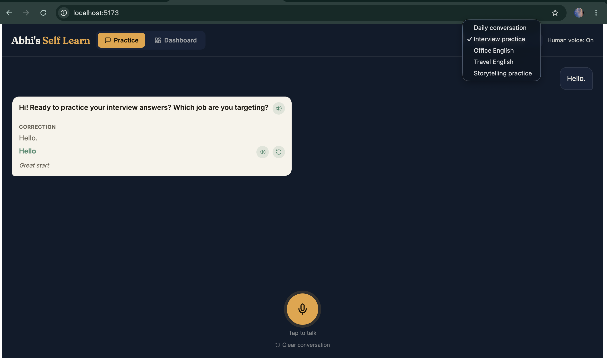

# Abhi's Self Learn




# Abhi's Self Learn — Spoken English Practice Partner

An opinionated, full-stack spoken-English practice application built to
simulate a patient, helpful speaking partner. It transcribes your speech
using Groq Whisper, corrects and coaches sentences with a Groq LLM, keeps
recent conversation memory so replies stay on topic, and can speak back
using Groq Orpheus (human-like voice) or the browser TTS fallback.

This repo is suitable for demos, portfolio showcases, and early-stage
technical interviews — it highlights integrations with modern LLM and
speech APIs, a simple analytics pipeline for learning progress, and a
clean React + FastAPI architecture.

Highlights / demo-ready features
- Accurate speech-to-text via Groq Whisper (`whisper-large-v3-turbo`).
- Conversation memory: server-side recent-turns to keep replies coherent.
- Practice modes: Daily, Interview, Office, Travel, Storytelling.
- Mistake coaching: flagged phrases, one-line explanations, encouraging feedback.
- Repeat-after-me: app plays corrected sentence, records your repeat, scores it.
- Progress dashboard: speaking minutes, streaks, most-common mistake types.
- Human voice via Groq Orpheus with a safe browser fallback.

Tech stack
- Frontend: React + Vite, MediaRecorder API, browser SpeechSynthesis fallback.
- Backend: FastAPI, SQLAlchemy + SQLite, requests-based Groq client.
- Models/APIs used: Groq Whisper (STT), Groq LLMs (correction & conversation), Groq Orpheus (TTS).
- Dev: Docker + docker-compose for easy local deployment.

Repository layout

```
abhis-self-learn/
├── backend/          FastAPI + SQLite
│   ├── app/          # main.py, llm.py, models.py, crud.py, schemas.py
│   ├── requirements.txt
│   └── .env.example  # copy this to .env locally (do NOT commit .env)
├── frontend/          # React + Vite app
│   └── src/App.jsx    # main UI: mic, chat, dashboard
└── docker-compose.yml
```

Quickstart — local development

1) Backend

```bash
cd backend
python3 -m venv venv
source venv/bin/activate
pip install -r requirements.txt
cp .env.example .env
# edit backend/.env and paste your GROQ_API_KEY (local only)
uvicorn app.main:app --reload --port 8000
```

2) Frontend (in a second terminal)

```bash
cd frontend
npm install
npm run dev
```

Open http://localhost:5173 — the frontend proxies `/api/*` to
`http://localhost:8000` (development config).

Docker (one-line)

```bash
cp backend/.env.example backend/.env
# edit backend/.env locally with your GROQ key
docker compose up --build
```

API overview (developer-friendly)

- `POST /api/correct` — payload: `{ text, user_id, mode, duration_seconds }` → returns corrected sentence, mistakes array, conversational reply.
- `POST /api/transcribe` — raw audio → returns `{ text }` from Groq Whisper.
- `POST /api/repeat` — form file `file` + `expected` text → transcribes repeat and returns similarity `score` and short `feedback`.
- `POST /api/speech` — `{ text, voice? }` → Groq Orpheus WAV (or error if not enabled).
- `GET /api/mistakes` and `GET /api/progress` — dashboard data.

Security & secrets (very important)

- Do NOT commit `backend/.env` containing your `GROQ_API_KEY`. Use
  `backend/.env.example` as the template.
- The repo includes a `.gitignore` entry for `backend/.env`. If you
  accidentally committed secrets, follow the README instructions to
  remove them from history (git-filter-repo or BFG) before pushing.
- For production, store the Groq API key in a secure secret store (GitHub
  Secrets, environment variables in your host, or a secret manager).

Why this is portfolio- and interview-ready

- Integrates modern generative AI APIs end-to-end (speech → LLM → TTS).
- Shows practical engineering: background workers, DB-backed user history,
  and a reusable API surface (clearly defined Pydantic schemas).
- Demonstrates UX thinking: friendly coaching messages, repeat practice,
  and a progression dashboard useful for product discussions.

Contributing / next steps

- Add user accounts and per-user encryption for multi-user deployments.
- Improve progress analytics (charts, per-error trends, personalized lessons).
- Add E2E tests for audio upload + transcription flows.

Contact / demo

If you'd like, I can prepare a deployable Docker image and a short
recorded demo to showcase the app to hiring managers. Tell me which
platform you prefer (Heroku/GCP/AWS) and I will prepare deployment notes.


## Preparing to publish to GitHub (don't leak secrets)

Before you push this repository to GitHub, make sure your Groq API key is
kept out of the commit history and that the repository does not contain
`backend/.env` with the real secret. The project includes a safe example
file at `backend/.env.example` which contains no secrets — copy that to
`backend/.env` locally and paste your real key there.

Recommended steps:

```bash
# 1) Ensure local-only env is ignored
echo 'backend/.env' >> .gitignore

# 2) If you have not yet committed, initialize and push
git init
git add .
git commit -m "Initial commit"
git branch -M main
git remote add origin <git-remote-url>
git push -u origin main

# 3) If you already committed backend/.env (dangerous): remove it from
# the index and commit the removal before pushing
git rm --cached backend/.env
git commit -m "Remove local env from repo"
git push
```

If `backend/.env` was already committed in earlier commits, remove it from
history using one of these approaches (these rewrite history — be careful):

- Using `git filter-repo` (recommended):

```bash
# install: pip install git-filter-repo
git filter-repo --path backend/.env --invert-paths
git push --force
```

- Or using BFG Repo Cleaner:

```bash
# install BFG (https://rtyley.github.io/bfg-repo-cleaner/)
bfg --delete-files backend/.env
git reflog expire --expire=now --all && git gc --prune=now --aggressive
git push --force
```

Finally, store your GROQ_API_KEY securely in the target GitHub repo's
Secrets (Settings → Secrets) and do not add it directly to the codebase.

# abhi-s-english-learn-application
